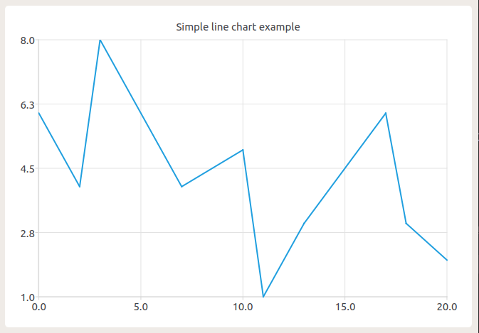

# Time Optimal Car Model Trajectory 

some brief here ...

## C++ Class Introduction

### 1. Model

### 2. Map

I tried to use this class for visualization.
Intended to use *OpenCV*, but it's difficult to convert double-type points into pixel coordinates.
Actually there is a way to do so, but after consideration of time-cost and practical element, finally I decided to use *Qt*.

So if you'd like to use this lib on your own machine, you might need to install Qt5, mostly its libraries.
*QtCreator* is also recommended, it's a convenient *Qt* IDE.
Although I prefer `Clion` with the powerful function of it.

#### config of Qt project in Clion

you can refer to [Clion instructions](https://www.jetbrains.com/help/clion/qt-tutorial.html), but I've got an easier way to do so.

Because we only need some simple Gui part of Qt to draw common lines, so we can just add a demo Qt project to our project, like the 

* [TestQt.cc](./Examples/TestQt.cc)
* [mainwindow.cpp](./src/mainwindow.cpp)
* [mainwindow.h](./src/mainwindow.h)
* [mainwindow.ui](./src/mainwindow.ui)
* [CMakeList.txt](./CMakeLists.txt)

These consists a demo code of Qt, tested on ubuntu18.04 with Qt5 on Clion and vscode.

We can see the result of demo code:

