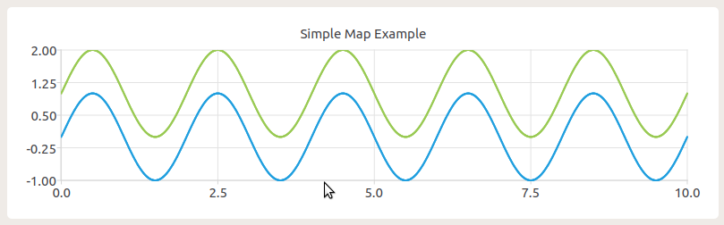

# Time Optimal Car Model Trajectory 

some brief here ...

* get an initial solution, using hybrid A*, or Dubins curve; solution includes the state variable and control variable at each point;
* using SCP method to get a smoother path?

## Reference

* [Practical Search Techniques in Path Planning for Autonomous Driving](https://ai.stanford.edu/~ddolgov/papers/dolgov_gpp_stair08.pdf)
* [Hybrid A* Based Motion Planning for Autonomous Vehicles in Unstructured Environment](https://ieeexplore.ieee.org/stamp/stamp.jsp?tp=&arnumber=8702779)
* [Kinodynamic Planning by ETH](https://stanfordasl.github.io/wp-content/papercite-data/pdf/Schmerling.Pavone.EOR19.pdf)
* [Kinodynamic Motion Planning by UC Berkeley](https://people.eecs.berkeley.edu/~jfc/papers/93/DXCRjacm93.pdf)
* [【论文研读】路径规划中的Hybrid A*算法 ](https://zhuanlan.zhihu.com/p/161660932)
* [karlkurzer](https://github.com/karlkurzer)/**[path_planner](https://github.com/karlkurzer/path_planner)**
* [Hybrid A* ROS源码中文注释](https://github.com/teddyluo/hybrid-a-star-annotation)
* [Dubins曲线详细笔记](https://zhuanlan.zhihu.com/p/414753861)
* [航迹规划——Dubins曲线](https://www.guyuehome.com/17685)

## Dependency

* Qt5
* `sudo apt install libqt5charts5-dev`

## C++ Class Introduction

### 1. Model

### 2. Map

I tried to use this class for visualization.
Intended to use *OpenCV*, but it's difficult to convert double-type points into pixel coordinates.
Actually there is a way to do so, but after consideration of time-cost and practical element, finally I decided to use *Qt*.

So if you'd like to use this lib on your own machine, you might need to install Qt5, mostly its libraries.
*QtCreator* is also recommended, it's a convenient *Qt* IDE.
Although I prefer `Clion` with the powerful function of it.

#### config of Qt project in Clion

you can refer to [Clion instructions](https://www.jetbrains.com/help/clion/qt-tutorial.html), but I've got an easier way to do so.

Because we only need some simple Gui part of Qt to draw common lines, so we can just add a demo Qt project to our project, like the 

* [TestQt.cc](./Examples/TestQt.cc)
* [mainwindow.cpp](./src/mainwindow.cpp)
* [mainwindow.h](./src/mainwindow.h)
* [mainwindow.ui](./src/mainwindow.ui)
* [CMakeList.txt](./CMakeLists.txt)

These consists a demo code of Qt, tested on ubuntu18.04 with Qt5 on Clion and vscode.

We can see the result of demo code:

and add another series:

